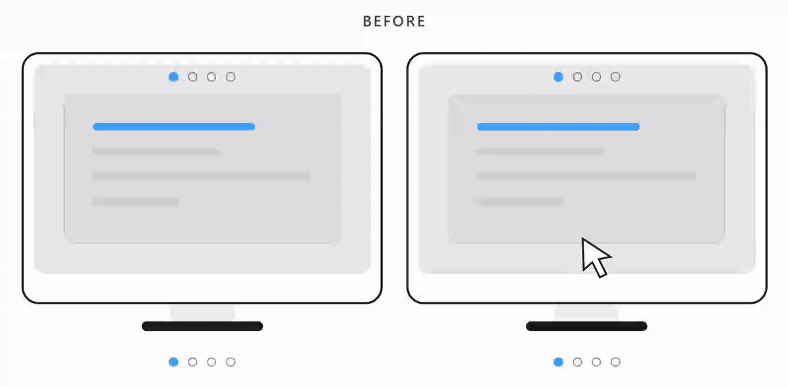

# Independent Monitor Workspaces

  

Independent, fast workspace switching for each monitor on Windows 11.

Windows virtual desktops switch every display together. This lightweight AutoHotkey v2 utility gives each monitor its own workspace state: point at a screen, switch, and only the windows on that screen change. Other monitors stay exactly where they are.

- Instant asynchronous switching with no staggered window-by-window delay
- Smooth slide-and-fade workspace indicator
- Native cursor-to-monitor detection across mixed DPI and scaling
- Automatic support for one, two, three, four, or more connected monitors
- Safe reset when displays are connected, disconnected, docked, or rearranged
- No background service, driver, scheduled task, registry edit, telemetry, or administrator requirement

## Install in one command

Open PowerShell and run:

~~~powershell
irm https://raw.githubusercontent.com/Allaa-boutaleb/windows-per-monitor-workspaces/main/install.ps1 | iex
~~~

That is the entire setup. The installer downloads the readable workspace script and an isolated portable AutoHotkey v2 runtime into `%LOCALAPPDATA%\IndependentMonitorWorkspaces`, creates a normal per-user Startup shortcut, and launches it.

You do not need AutoHotkey, `winget`, administrator access, or anything preinstalled. The installer does not modify `PATH` or install AutoHotkey system-wide.

Prefer to inspect commands first? Read [install.ps1](install.ps1), then run it locally.

### Installer safeguards

- Downloads the pinned official [AutoHotkey v2.0.26 release](https://github.com/AutoHotkey/AutoHotkey/releases/tag/v2.0.26)
- Verifies the runtime ZIP against its pinned SHA-256 before extracting it
- Validates the workspace script with AutoHotkey before replacing a working install
- Builds updates in a staging directory and restores the previous files and Startup entry if any later step fails
- Retries temporary download failures
- Uses a native Windows Shell shortcut fallback if WScript shortcut creation is unavailable
- Leaves user-managed AutoHotkey installations untouched

## Controls

Point the mouse at the monitor you want to control, then use:

| Shortcut | Action |
|---|---|
| `Win+Ctrl+Left` / `Win+Ctrl+Right` | Previous / next workspace on that monitor |
| `Win+Ctrl+1` ... `Win+Ctrl+4` | Open a numbered workspace on that monitor |
| `Win+Ctrl+Shift+1` ... `Win+Ctrl+Shift+4` | Move the active window to a workspace |
| `Win+Ctrl+Shift+Esc` | Reveal every window and reset all workspace state |

Four workspaces are enabled by default. Change `WORKSPACE_COUNT := 4` near the top of the script to any value from 1 to 9.

## Uninstall in one command

~~~powershell
irm https://raw.githubusercontent.com/Allaa-boutaleb/windows-per-monitor-workspaces/main/uninstall.ps1 | iex
~~~

Uninstalling reveals windows managed by the utility, removes its Startup entry, script, metadata, and isolated portable runtime. If you explicitly installed with your own AutoHotkey executable, that executable is never removed.

## Manual or offline installation

To use an existing AutoHotkey v2 executable:

~~~powershell
.\install.ps1 -SourceScriptPath .\IndependentMonitorWorkspaces.ahk -AutoHotkeyPath "C:\path\to\AutoHotkey64.exe"
~~~

For a fully offline install, download the official AutoHotkey v2.0.26 ZIP and this repository first:

~~~powershell
.\install.ps1 -SourceScriptPath .\IndependentMonitorWorkspaces.ahk -RuntimeArchivePath .\AutoHotkey_2.0.26.zip
~~~

The same checksum and syntax validation are applied to offline files.

## How it works

Windows exposes one active native virtual desktop across the full display topology. This utility stays on one native Windows desktop and maintains lightweight window groups for each physical monitor. Switching a monitor sends asynchronous show/hide requests only to windows assigned to that monitor.

Monitor targeting uses the native Windows `HMONITOR` device under the physical cursor instead of comparing logical screen coordinates. This avoids the common wrong-monitor problem on displays with different scaling factors.

Display count is dynamic. One monitor works like a normal workspace switcher; additional monitors receive independent state automatically. A Windows display-topology notification triggers a safe reveal-and-reset after docking, unplugging, rearranging, or resolution changes.

## Compatibility and requirements

- Windows 11
- Windows PowerShell 5.1 or PowerShell 7
- x64 Windows
- Windows 11 on Arm through Microsoft's built-in [x64 app emulation](https://learn.microsoft.com/windows/arm/apps-on-arm-x86-emulation)
- Multiple monitors are optional
- Internet access for the one-command installer; offline installation is supported

Standard locked-down enterprise policies can still block PowerShell scripts, GitHub downloads, WMI process inspection, or per-user Startup entries. The installer reports the failed step and preserves the prior installation, but it does not bypass organization security policy.

## Installer testing

The repository runs the installer suite on `windows-latest` with both Windows PowerShell 5.1 and PowerShell 7. It covers:

- Clean install with no `winget` and no AutoHotkey on `PATH`
- Paths containing spaces and non-ASCII characters
- WScript and native Windows Shell Startup shortcut paths
- Idempotent updates
- Invalid script, syntax, checksum, and malformed ZIP rejection
- Rollback after a post-swap failure
- Bundled and user-managed runtime removal behavior
- The live public GitHub download path

Run the same tests locally:

~~~powershell
.\tests\Test-Installer.ps1
~~~

## Limitations

- These are independent window workspaces, not separate native Windows virtual desktops.
- Keep Windows itself on one native virtual desktop while using the utility.
- Wallpaper and desktop icons do not change between workspaces.
- Elevated applications cannot be controlled by a non-elevated script. Running the utility as administrator is possible but generally unnecessary.
- A small number of specialized or protected application windows may ignore standard Windows show/hide messages.

If anything behaves unexpectedly, press `Win+Ctrl+Shift+Esc` to reveal everything and reset.

## License

[MIT](LICENSE)
